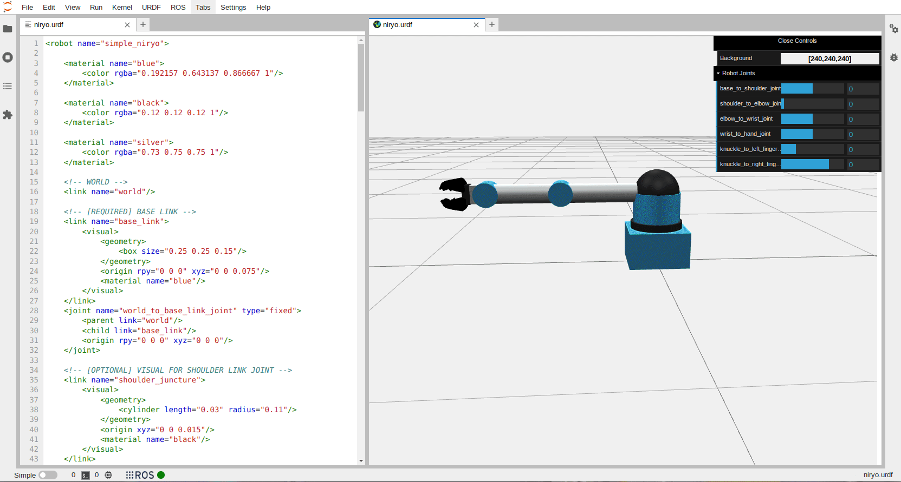

.. jupyterlab-urdf documentation master file, created by
   sphinx-quickstart on Mon Jul  4 13:37:31 2022.
   You can adapt this file completely to your liking, but it should at least
   contain the root `toctree` directive.

Welcome to JupyterLab-URDF's documentation!
===========================================

With this JupyterLab extension, you can easily create and modify URDF files from the comfort of your web browser.

Try it with JupyterLite!
------------------------

.. image:: https://jupyterlite.rtfd.io/en/latest/_static/badge.svg
   :target: https://jupyterlab-urdf.readthedocs.io/en/latest/lite/lab/index.html?path=robot.urdf

.. jupyterlite:: robot.urdf

.. toctree::
   :maxdepth: 2
   :caption: General:

   src/gen_getting_started

.. toctree::
   :maxdepth: 2
   :caption: Usage:

   src/use_editor
   src/use_viewer
   src/use_examples

.. toctree::
   :maxdepth: 2
   :caption: Development:

   src/dev_contribute
   src/dev_install
   src/dev_docs

Indices and tables
==================

* :ref:`genindex`
* :ref:`modindex`
* :ref:`search`
