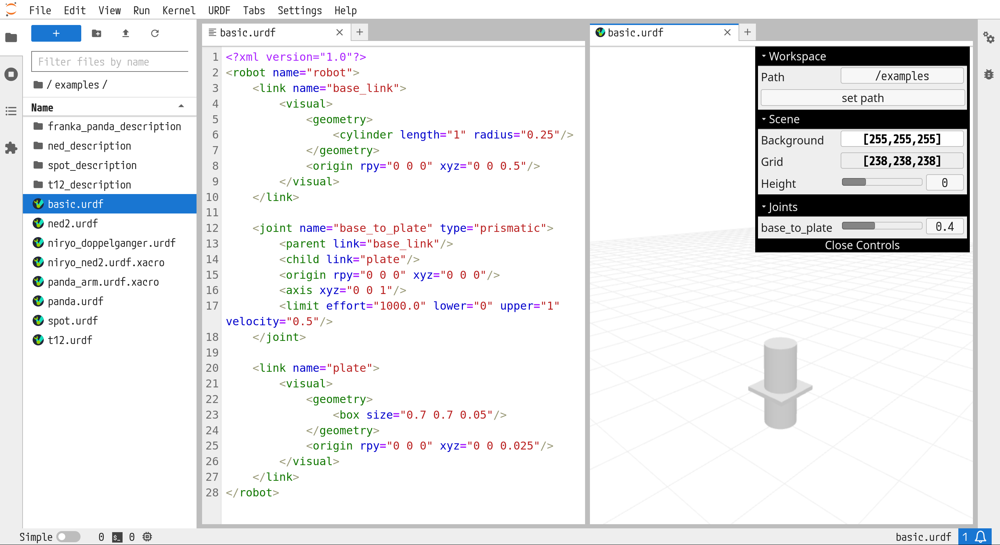
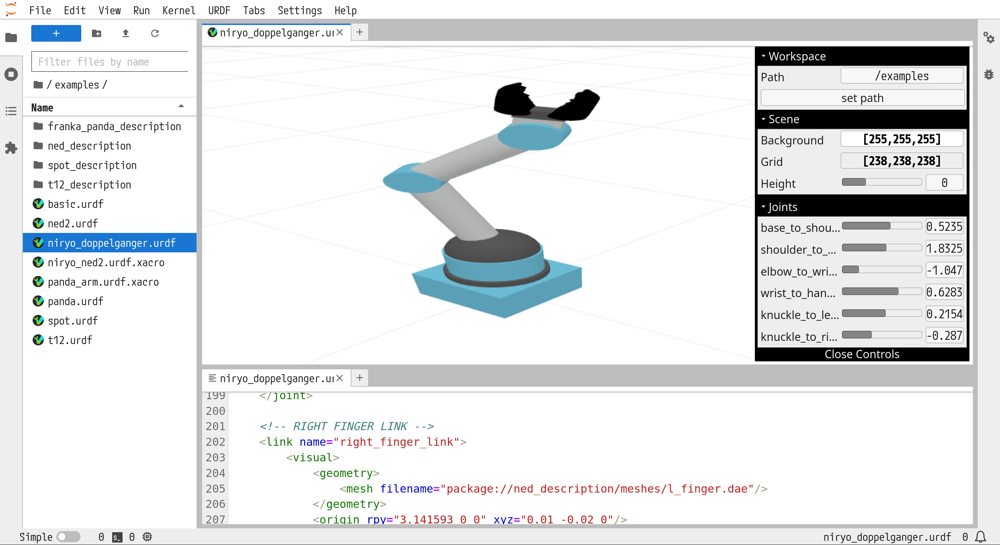
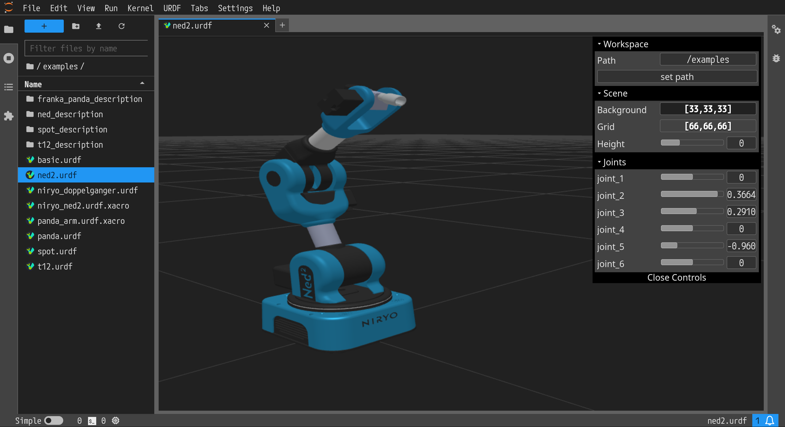
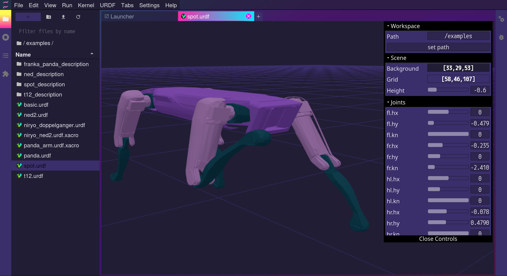
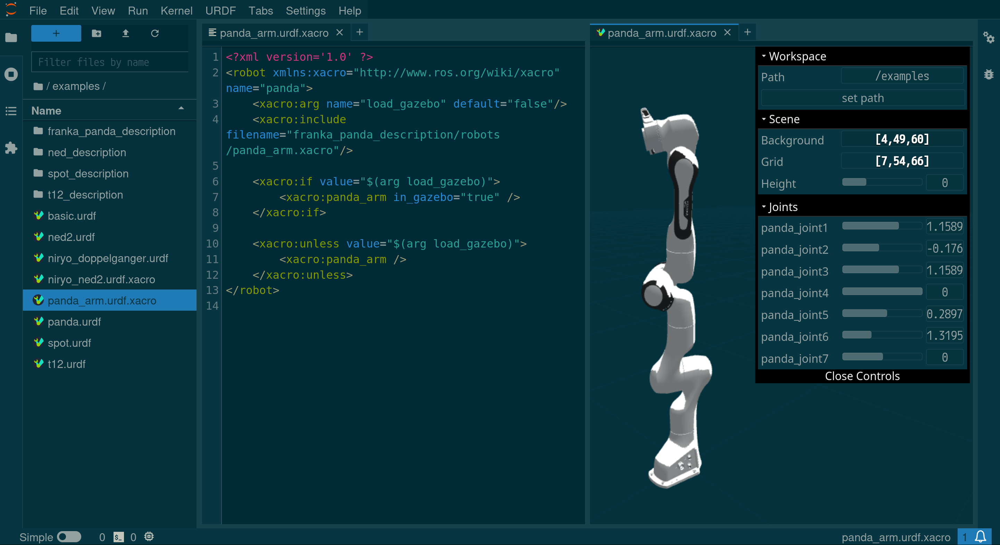
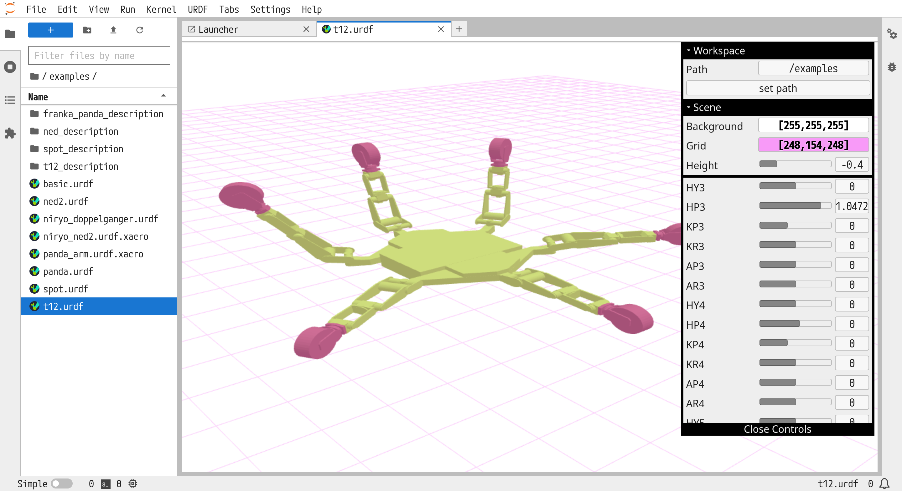

Examples
========

Basic Robot
-----------

This robot is simply two geometric components with a single prismatic joint.

Niryo
-----

The examples include a simplified version of Niryo which links a mesh file to
create the gripping mechanism.

.. note::
    The *Path* is relative to the directory where JupyterLab is launched from. 
    When modifying, this path should point to the location of the robot
    description packages containing the mesh files. In this case, the path is
    by default set to */examples* because this is the parent directory of the
    robot description packages.

Spot
----

Panda
-----

Xacro files are also supported. However, it is not (yet) possible to search for
packages with ``$(find robot_description)``. 

T12
---

